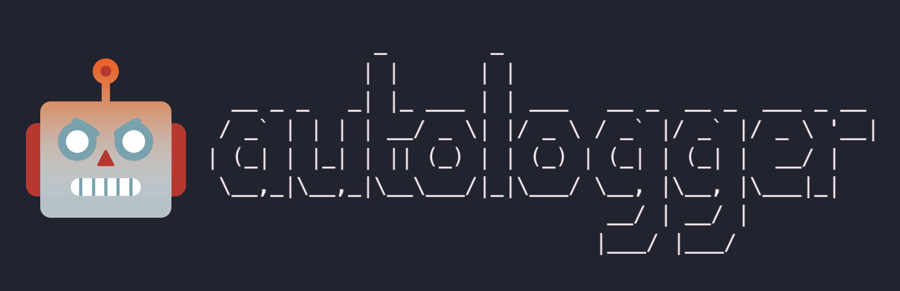

<br/>

Autologger is a friction log generator tool.

## How it works

_TODO: diagram of -aaS implementation_

## Running locally

#### Requirements

* A Google Cloud Storage bucket to which you have write access
* A Google Cloud project with the following APIs enabled:
  * VertexAI

### Direct script execution
TODO: allow passing project and bucket IDs as env vars

_developed with Python 3.12; other versions may work but are not tested_

```python
  cd src
  pip install -r requirements.txt
  python app.py
```

### Containerized execution
TODO: allow passing bucket IDs as env vars

```sh
  export CONTAINER_PATH=us-docker.pkg.dev/cpet-stanke-sandbox/autologger/autologger
  docker build . -t $CONTAINER_PATH
  docker run -v "$HOME/.config/gcloud/application_default_credentials.json":/gcp/creds.json --env GOOGLE_APPLICATION_CREDENTIALS=/gcp/creds.json --env GOOGLE_CLOUD_PROJECT=autologger -d -p 8080:8080 $CONTAINER_PATH
```

### As a service
TODO: allow passing bucket ID as env var (project should just use whatever project it's running in)

⚠️ NOTE: to run in Cloud Run, it's recommended to build the container with Cloud Build, to avoid [OS compatibility issues](https://cloud.google.com/run/docs/troubleshooting#:~:text=Note%3A%20If%20you%20build%20your%20container%20image%20on%20a%20ARM%20based%20machine%2C%20then%20it%20might%20not%20work%20as%20expected%20when%20used%20with%20Cloud%20Run.).

The built container can be run as a Cloud Run service.

## Sources

- [Moviepy](https://pypi.org/project/moviepy/)
- [Mdutils](https://pypi.org/project/mdutils/)
- [Gemini on Vertex AI - Python SDK](https://cloud.google.com/vertex-ai/generative-ai/docs/start/quickstarts/quickstart-multimodal)
- [ASCII art](https://patorjk.com/software/taag/#p=display&h=2&v=2&f=Modular&t=autologger)
- [Robot emoji](https://emoji.supply/kitchen/?%F0%9F%98%A1+%F0%9F%A4%96=8ww1kx)
