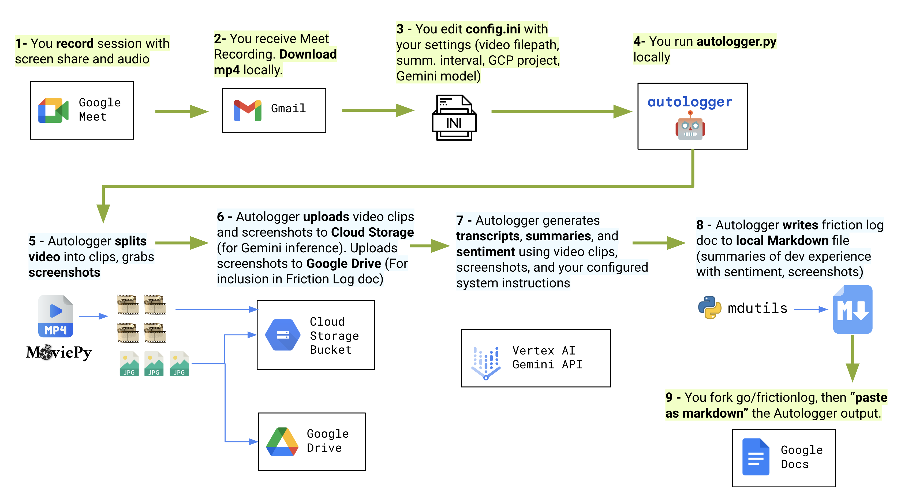

 

Autologger is a friction log generator tool.

## How it works

## Quickstart 

*Note: This is an early prototype. It was tested on local MacOS Sonoma, using an external Drive test account.* 

1. Clone repo. 
2. `cd autologger/src/` 
3. `python3 -m venv venv` 
4. `source venv/bin/activate`
5. `pip install -r requirements.txt`
6. Download Google Meet recording of a friction log session. 
7. Get Google Drive/Docs OAuth `credentials.json` by following [these instructions](). Save to `src/`.
8. Edit `config.ini` with your info. 
9.  Run `python autologger.py`. 
10. Get the output Markdown file in the `output/` directory. Copy the contents.  
11. Open a new Google Doc. 
12. Click Edit > Paste as Markdown. 

## Sources 
- [Moviepy](https://pypi.org/project/moviepy/)
- [Mdutils)](https://pypi.org/project/mdutils/)
- [Gemini on Vertex AI - Python SDK](https://cloud.google.com/vertex-ai/generative-ai/docs/start/quickstarts/quickstart-multimodal) 
- [ASCII art](https://patorjk.com/software/taag/#p=display&h=2&v=2&f=Modular&t=autologger)
- [Robot emoji](https://emoji.supply/kitchen/?%F0%9F%98%A1+%F0%9F%A4%96=8ww1kx)