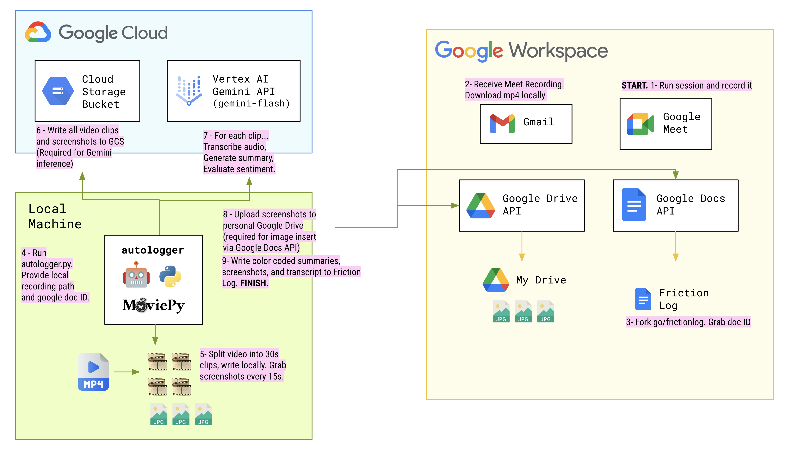

 

A friction log generator.

## Architecture 

## Quickstart 

*Note: This was tested on local MacOS Sonoma, using CPET Joonix's Google Workspace (Drive/Docs)* 

1. Clone repo. 
2. `cd autologger/src/` 
3. `python3 -m venv .` 
4. `source bin/activate`
5. `pip install -r requirements.txt`
6. Download Google Meet recording of a friction session. 
7. Fork go/frictionlog into a Joonix Google Doc. Copy doc ID (from URL) 
8. Get Google Drive/Docs OAuth `credentials.json` by following [these instructions](). Save to `src/`.
9. Open `src/autologger.py`. Modify the following:
        - `doc_id` = your doc ID 
        - `gcs_folder_prefix` = some slug for your FL topic (not used for the output friction log, just used to organize the video and screenshots in GCS for Gemini processing)
        - (At the bottom of the file) update the autologger param (local video path) to match the local saved path of your Google Meet recording (mp4). 
10. Run `python autologger.py`. 

## Sources 
- [Moviepy](https://pypi.org/project/moviepy/)
- [Google Docs Python SDK](https://developers.google.com/docs/api/quickstart/python)
- [Gemini on Vertex AI - Python SDK](https://cloud.google.com/vertex-ai/generative-ai/docs/start/quickstarts/quickstart-multimodal) 
- [ASCII art](https://patorjk.com/software/taag/#p=display&h=2&v=2&f=Modular&t=autologger)
- [Robot emoji](https://emoji.supply/kitchen/?%F0%9F%98%A1+%F0%9F%A4%96=8ww1kx)